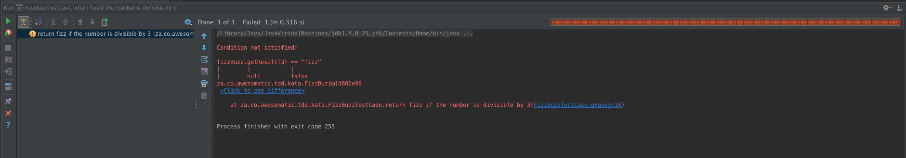
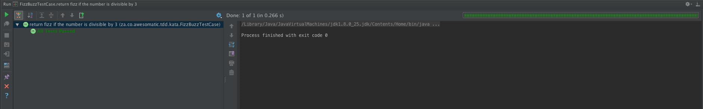
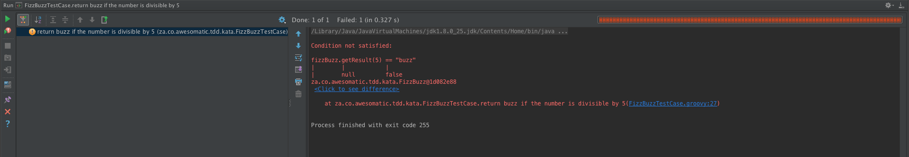
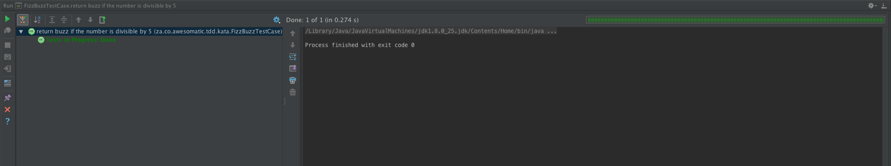
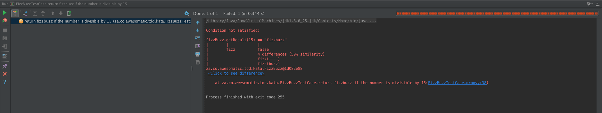
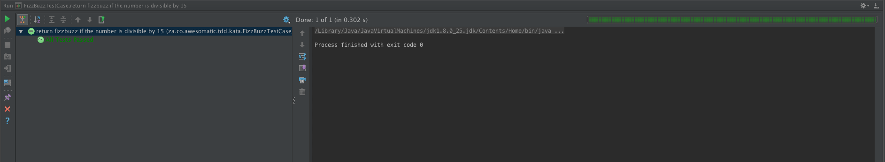
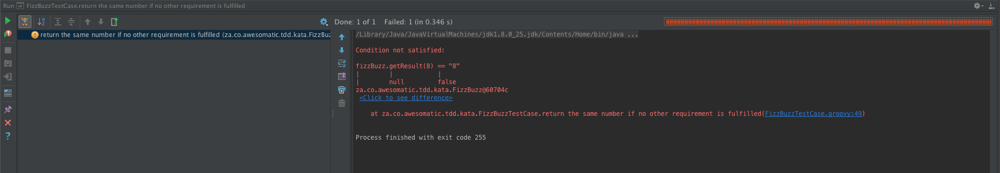
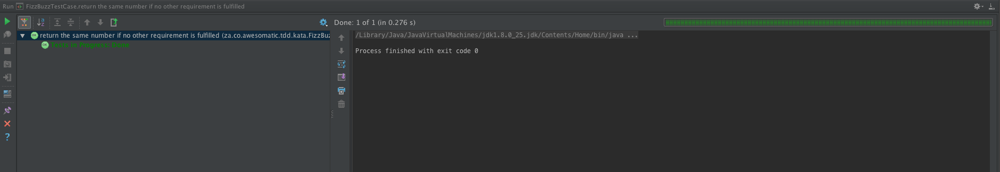
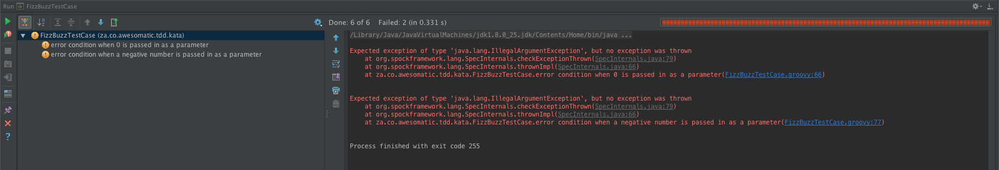
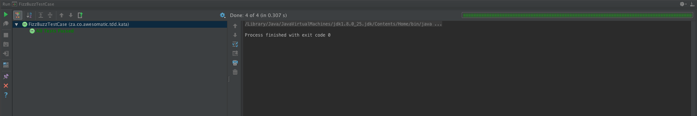

# Fizz Buzz Kata
Return "fizz", "buzz" or "fizzbuzz"

For a given natural number greater than zero return:  
1. "fizz" if the number is divisible by 3  
2. "buzz" if the number is divisible by 5  
3. "fizzbuzz" if the number is divisible by 15  
4. the same number if no other requirements are fulfilled  

# Solution
Normal developer instinct would dictate that you straight away write the implementation without the test case, but that is not the way how **Test Driven Development** (TDD) works...

# TDD Primer
The basic premise of TDD is that you write a test before writing the code that actually provides the implementation, and then you refactor that implementation as needed.
## The TDD 3-phase cycle
When TDD practitioners need to implement a feature, they first write a failing test that describes, or specifies, that feature. Next, they write just enough code to make the test pass. Finally, they refactor the code to help ensure that it will be easy to maintain.  


Let us see how can apply these TDD techniques to fulfil the requirements given above.

# The first test
## Create a class with no implementation
```java
public class FizzBuzz {

    public String getResult(int number) {
        return null;
    }
}
```
## Create a Unit Test and the first test criteria  
### JUnit
```java
public class FizzBuzzTest {
    FizzBuzz fizzBuzz;

    @Before
    public void setUp() throws Exception {
        fizzBuzz = new FizzBuzz();
    }

    @Test
    public void return_fizz_if_the_number_is_divisible_by_3() {
        assertEquals(fizzBuzz.getResult(3), "fizz");
        assertEquals(fizzBuzz.getResult(6), "fizz");
    }
}
```
### Spock
```java
class FizzBuzzTestCase extends Specification {
    FizzBuzz fizzBuzz

    def setup() {
        fizzBuzz = new FizzBuzz()
    }

    def "return fizz if the number is divisible by 3"() {
        expect: "3 divided by 3 to return fizz"
            fizzBuzz.getResult(3) == "fizz"

        and: "6 divided by 6 to return fizz"
            fizzBuzz.getResult(6) == "fizz"
    }
}
```
### Failing test case  

### Implementation
```java
public class FizzBuzz {

    public String getResult(int number) {
        if(number % 3 == 0) return "fizz";
        return null;
    }
}
```
### Passing test case


# The second test
## Second test criteria
### JUnit
```java
public class FizzBuzzTest {
    FizzBuzz fizzBuzz;

    @Before
    public void setUp() throws Exception {
        fizzBuzz = new FizzBuzz();
    }

    @Test
    public void return_fizz_if_the_number_is_divisible_by_3() {
        assertEquals(fizzBuzz.getResult(3), "fizz");
        assertEquals(fizzBuzz.getResult(6), "fizz");
    }

    @Test
    public void return_buzz_if_the_number_is_divisible_by_5() throws Exception {
        assertEquals(fizzBuzz.getResult(5), "buzz");
        assertEquals(fizzBuzz.getResult(10), "buzz");
    }
}
```
### Spock
```java
class FizzBuzzTestCase extends Specification {
    FizzBuzz fizzBuzz

    def setup() {
        fizzBuzz = new FizzBuzz()
    }

    def "return fizz if the number is divisible by 3"() {
        expect: "3 divided by 3 to return fizz"
            fizzBuzz.getResult(3) == "fizz"

        and: "6 divided by 6 to return fizz"
            fizzBuzz.getResult(6) == "fizz"
    }

    def "return buzz if the number is divisible by 5"() {
        expect: "5 divided by 5 to return buzz"
            fizzBuzz.getResult(5) == "buzz"

        and: "10 divided by 5 to return buzz"
            fizzBuzz.getResult(10) == "buzz"
    }
}
```
### Failing test case

### Implementation
```java
public class FizzBuzz {

    public String getResult(int number) {
        if(number % 3 == 0) return "fizz";
        if(number % 5 == 0) return "buzz";
        return null;
    }
}
```
### Passing test case

# The third test
## Third test criteria
### JUnit
```java
public class FizzBuzzTest {
    FizzBuzz fizzBuzz;

    @Before
    public void setUp() throws Exception {
        fizzBuzz = new FizzBuzz();
    }

    @Test
    public void return_fizz_if_the_number_is_divisible_by_3() {
        assertEquals(fizzBuzz.getResult(3), "fizz");
        assertEquals(fizzBuzz.getResult(6), "fizz");
    }

    @Test
    public void return_buzz_if_the_number_is_divisible_by_5() throws Exception {
        assertEquals(fizzBuzz.getResult(5), "buzz");
        assertEquals(fizzBuzz.getResult(10), "buzz");
    }

    @Test
    public void return_fizzbuzz_if_the_number_is_divisible_by_15() throws Exception {
        assertEquals(fizzBuzz.getResult(15), "fizzbuzz");
        assertEquals(fizzBuzz.getResult(30), "fizzbuzz");
    }
}    
```
### Spock
```java
class FizzBuzzTestCase extends Specification {
    FizzBuzz fizzBuzz

    def setup() {
        fizzBuzz = new FizzBuzz()
    }

    def "return fizz if the number is divisible by 3"() {
        expect: "3 divided by 3 to return fizz"
            fizzBuzz.getResult(3) == "fizz"

        and: "6 divided by 6 to return fizz"
            fizzBuzz.getResult(6) == "fizz"
    }

    def "return buzz if the number is divisible by 5"() {
        expect: "5 divided by 5 to return buzz"
            fizzBuzz.getResult(5) == "buzz"

        and: "10 divided by 5 to return buzz"
            fizzBuzz.getResult(10) == "buzz"
    }

    def "return fizzbuzz if the number is divisible by 15"() {
        expect: "15 divided by 15 to return fizzbuzz"
            fizzBuzz.getResult(15) == "fizzbuzz"

        and: "30 divided by 15 to return fizzbuzz"
            fizzBuzz.getResult(30)
    }
}
```
### Failing test case

### Implementation
```java
public class FizzBuzz {

    public String getResult(int number) {
        if(number % 15 == 0) return "fizzbuzz";
        if(number % 3 == 0) return "fizz";
        if(number % 5 == 0) return "buzz";
        return null;
    }
}
```
### Passing test case

# The fourth test
## Fourth test criteria
### JUnit
```java
public class FizzBuzzTest {
    FizzBuzz fizzBuzz;

    @Before
    public void setUp() throws Exception {
        fizzBuzz = new FizzBuzz();
    }

    @Test
    public void return_fizz_if_the_number_is_divisible_by_3() {
        assertEquals(fizzBuzz.getResult(3), "fizz");
        assertEquals(fizzBuzz.getResult(6), "fizz");
    }

    @Test
    public void return_buzz_if_the_number_is_divisible_by_5() throws Exception {
        assertEquals(fizzBuzz.getResult(5), "buzz");
        assertEquals(fizzBuzz.getResult(10), "buzz");
    }

    @Test
    public void return_fizzbuzz_if_the_number_is_divisible_by_15() throws Exception {
        assertEquals(fizzBuzz.getResult(15), "fizzbuzz");
        assertEquals(fizzBuzz.getResult(30), "fizzbuzz");
    }

    @Test
    public void return_the_same_number_if_no_other_requirement_is_fulfilled() throws Exception {
        assertEquals(fizzBuzz.getResult(8), "8");
        assertEquals(fizzBuzz.getResult(17), "17");
    }
}    

```
### Spock
```java
class FizzBuzzTestCase extends Specification {
    FizzBuzz fizzBuzz

    def setup() {
        fizzBuzz = new FizzBuzz()
    }

    def "return fizz if the number is divisible by 3"() {
        expect: "3 divided by 3 to return fizz"
            fizzBuzz.getResult(3) == "fizz"

        and: "6 divided by 6 to return fizz"
            fizzBuzz.getResult(6) == "fizz"
    }

    def "return buzz if the number is divisible by 5"() {
        expect: "5 divided by 5 to return buzz"
            fizzBuzz.getResult(5) == "buzz"

        and: "10 divided by 5 to return buzz"
            fizzBuzz.getResult(10) == "buzz"
    }

    def "return fizzbuzz if the number is divisible by 15"() {
        expect: "15 divided by 15 to return fizzbuzz"
            fizzBuzz.getResult(15) == "fizzbuzz"

        and: "30 divided by 15 to return fizzbuzz"
            fizzBuzz.getResult(30)
    }

    def "return the same number if no other requirement is fulfilled"() {
        expect: "8 divided by either 3, 5 or 15 to return 8"
            fizzBuzz.getResult(8) == "8"

        and: "17 divided by either 3, 5 or 15 should return 17"
            fizzBuzz.getResult(17) == "17"
    }
}
```
### Failing test case

### Implementation
```java
public class FizzBuzz {

    public String getResult(int number) {
        if(number % 15 == 0) return "fizzbuzz";
        if(number % 3 == 0) return "fizz";
        if(number % 5 == 0) return "buzz";
        return Integer.toString(number);
    }
}
```
### Passing test

# The Exceptional cases
The requirements clearly state that the number should be a natural number greater than zero meaning that it should be a whole, non-negaive number.
## Testing the exceptional cases
### JUnit
```java
public class FizzBuzzTest {
    FizzBuzz fizzBuzz;

    @Before
    public void setUp() throws Exception {
        fizzBuzz = new FizzBuzz();
    }

    @Test
    public void return_fizz_if_the_number_is_divisible_by_3() {
        assertEquals(fizzBuzz.getResult(3), "fizz");
        assertEquals(fizzBuzz.getResult(6), "fizz");
    }

    @Test
    public void return_buzz_if_the_number_is_divisible_by_5() throws Exception {
        assertEquals(fizzBuzz.getResult(5), "buzz");
        assertEquals(fizzBuzz.getResult(10), "buzz");
    }

    @Test
    public void return_fizzbuzz_if_the_number_is_divisible_by_15() throws Exception {
        assertEquals(fizzBuzz.getResult(15), "fizzbuzz");
        assertEquals(fizzBuzz.getResult(30), "fizzbuzz");
    }

    @Test
    public void return_the_same_number_if_no_other_requirement_is_fulfilled() throws Exception {
        assertEquals(fizzBuzz.getResult(8), "8");
        assertEquals(fizzBuzz.getResult(17), "17");
    }

    @Test(expected = IllegalArgumentException.class)
    public void error_condition_when_0_is_passed_an_argument() throws Exception {
        fizzBuzz.getResult(0);
    }

    @Test(expected = IllegalArgumentException.class)
    public void error_condition_when_a_negative_number_is_passed_as_an_argument() throws Exception {
        fizzBuzz.getResult(-15);
    }
}
```
### Spock
```java
class FizzBuzzTestCase extends Specification {
    FizzBuzz fizzBuzz

    def setup() {
        fizzBuzz = new FizzBuzz()
    }

    def "return fizz if the number is divisible by 3"() {
        expect: "3 divided by 3 to return fizz"
            fizzBuzz.getResult(3) == "fizz"

        and: "6 divided by 6 to return fizz"
            fizzBuzz.getResult(6) == "fizz"
    }

    def "return buzz if the number is divisible by 5"() {
        expect: "5 divided by 5 to return buzz"
            fizzBuzz.getResult(5) == "buzz"

        and: "10 divided by 5 to return buzz"
            fizzBuzz.getResult(10) == "buzz"
    }

    def "return fizzbuzz if the number is divisible by 15"() {
        expect: "15 divided by 15 to return fizzbuzz"
            fizzBuzz.getResult(15) == "fizzbuzz"

        and: "30 divided by 15 to return fizzbuzz"
            fizzBuzz.getResult(30)
    }

    def "return the same number if no other requirement is fulfilled"() {
        expect: "8 divided by either 3, 5 or 15 to return 8"
            fizzBuzz.getResult(8) == "8"

        and: "17 divided by either 3, 5 or 15 should return 17"
            fizzBuzz.getResult(17) == "17"
    }

    def "error condition when 0 is passed in as a parameter"() {
        when: "0 is passed in as the parameter"
            fizzBuzz.getResult(0)

        then: "an exception should be thrown"
            thrown(IllegalArgumentException)
    }

    def "error condition when a negative number is passed in as a parameter"() {
        when: "a negative number is passed in as the parameter"
            fizzBuzz.getResult(-15)

        then: "an exception should be thrown"
            thrown(IllegalArgumentException)
    }
}
```
### Failing test cases

### Implementation
```java
public class FizzBuzz {

    public String getResult(int number) {
        if(number <= 0) throw new IllegalArgumentException("The number should be a natural number greater than zero i.e. a whole, non-negative number");
        if(number % 15 == 0) return "fizzbuzz";
        if(number % 3 == 0) return "fizz";
        if(number % 5 == 0) return "buzz";
        return Integer.toString(number);
    }
}
```
### Passing tests

# Refactor
With our test cases in place we can confidently refactor our code...
```java
public class FizzBuzz {

    public String getResult(int number) {
        if(number <= 0) throw new IllegalArgumentException("The number should be a natural number greater than zero i.e. a whole, non-negative number");
        return number % 15 == 0 ? "fizzbuzz" : number % 3 == 0 ? "fizz" : number % 5 == 0 ? "buzz" : Integer.toString(number);
    }
}
```
and verify that the code still fulfils the requirements  

